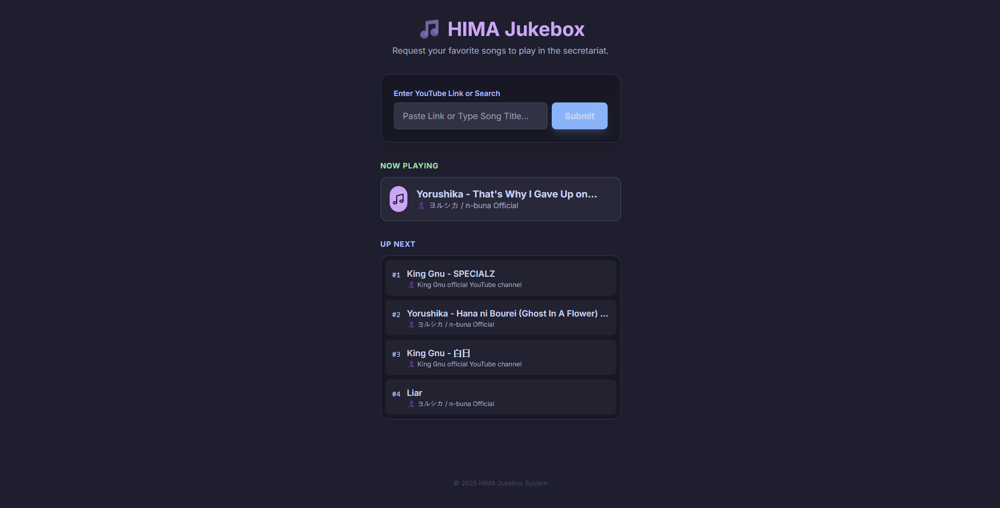
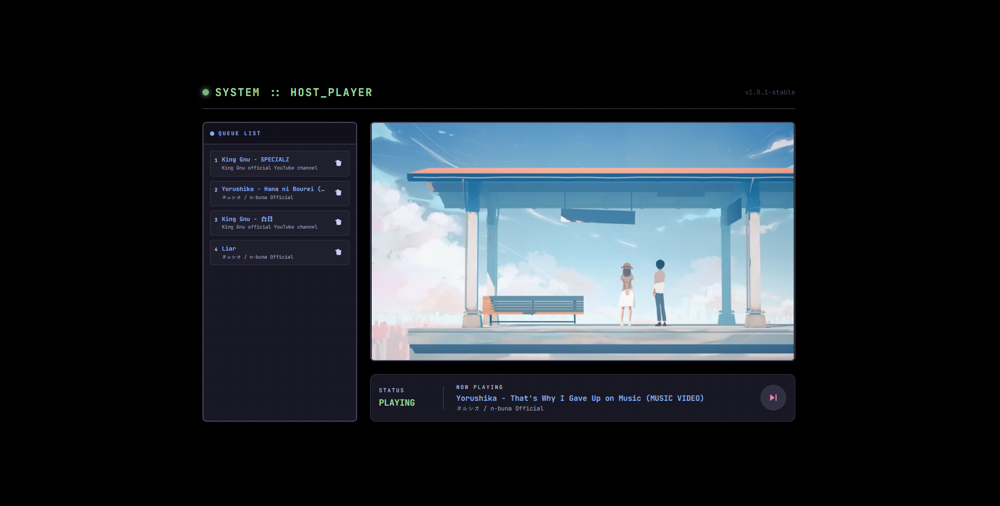

# 🎵 HIMA Jukebox System

A modern, real-time collaborative music queue system built with Node.js, Socket.io, and Tailwind CSS (Catppuccin Mocha theme).

Designed for shared spaces (like secretariats, offices, or parties) where one "Host" device plays music, and anyone on the same network can request songs via their phone or laptop.

## ✨ Features

- **Real-time Queue:** Songs added by users appear instantly on the host and other clients.
- **YouTube Integration:** Supports YouTube links and keyword searches.
- **Modern UI:** Beautiful dark mode interface using the Catppuccin Mocha palette.
- **Host Dashboard:** Dedicated admin view with player controls (Play, Pause, Skip) and status monitoring.
- **Auto-Play:** Automatically plays the next song in the queue when the current one ends.

## 📸 Preview

### Client Interface


### Host Dashboard


## 🛠️ Prerequisites

- **Node.js** (v14 or higher) installed on your system.

## 🚀 Installation

1.  **Clone the repository** (or download the source code):
    ```bash
    git clone https://github.com/farreru/hima-jukebox.git
    cd hima-jukebox
    ```

2.  **Install dependencies:**
    ```bash
    npm install
    ```

## ▶️ Usage

### 1. Start the Server
Run the following command in your terminal:
```bash
npm start
# OR
node server.js
```
The server will start at `http://localhost:3000`.

### 2. Accessing the Application
Open your browser and navigate to `http://localhost:3000`. You will be presented with a landing page where you can choose your role:

*   **Client Interface:** `http://localhost:3000/client` (for requesting songs)
*   **Host Dashboard:** `http://localhost:3000/host` (for playing and managing the queue)

### 3. Setup the Host (Audio Player)
*   On the device connected to speakers, go to the Host Dashboard (`http://localhost:3000/host`).
*   **Important:** Click the large **"INITIALIZE SYSTEM"** button to enable audio (due to browser autoplay policies).
*   Leave this tab open. This device will handle the audio playback.

### 4. Make Requests (Clients)
*   Open a browser on any device (phone, laptop) connected to the same Wi-Fi.
*   Go to the Client Interface (`http://<YOUR_IP_ADDRESS>:3000/client`) or `http://localhost:3000/client` if on the same machine.
*   Paste a **YouTube Link** or type a **Song Title** in the search box.
*   Click **"Submit"** to add it to the queue.

## 📁 Project Structure

```
.
├── server.js               # Main server entry point
├── package.json
├── package-lock.json
├── README.md
├── src/
│   ├── services/
│   │   └── youtubeService.js # Handles YouTube API interactions
│   ├── state/
│   │   └── playlistManager.js # Manages the application's playlist state
│   └── socket/
│       └── socketHandler.js  # Manages Socket.io event handling
└── public/
    ├── index.html          # Landing page to choose client/host
    ├── client/
    │   ├── index.html      # Client interface HTML
    │   └── main.js         # Client-side JavaScript logic
    └── host/
        ├── index.html      # Host dashboard HTML
        └── main.js         # Host-side JavaScript logic
```

## 🎨 Theme

The UI uses **Tailwind CSS** with the [Catppuccin Mocha](https://github.com/catppuccin/catppuccin) color scheme for a soothing, high-contrast dark mode experience.

## 📝 License

This project is open-source and available for personal or educational use.